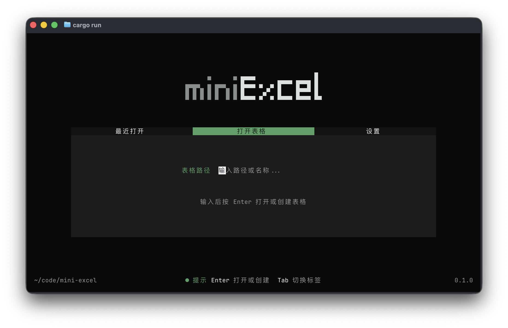

`miniExcel` 是一个基于 [Ratatui](https://ratatui.rs) 的终端表格应用。它提供类似电子表格的基础编辑体验，适合在终端里快速创建、打开和维护 `.mxlsx` 工作簿文件。

> 目前只是一个用于课程设计的玩具，许多功能暂未完善。

## 功能

- 键盘驱动的表格编辑
- 多单元格选中、复制和粘贴
- 部分公式解析

## Development

常用命令：

```bash
cargo fmt --check
cargo check
cargo test
```

项目依赖：

- `Ratatui`：终端 UI 框架
- `crossterm`：终端事件与输入处理
- `serde` / `serde_json`：工作簿和最近打开记录序列化
- `pest`：公式解析
- `arboard`：系统剪贴板

## 许可证

本项目使用 MIT License，详见 [LICENSE](LICENSE)
